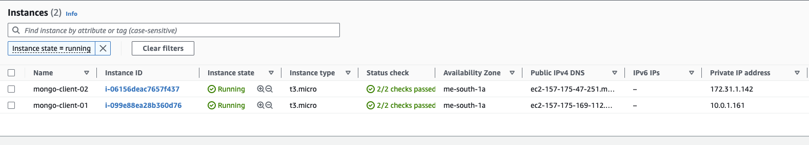

# Linking Multiple AWS VPCs to the same Atlas Cluster through Private Link

This project includes terraform scripts that:

* Create 2 VPCs in the given AWS account (or you can configure it to use multiple accounts)
* Create 2 subnets in each VPC
* Create an Atlas Cluster
* Enable the Private Endpoint Service in Atlas side
* Create a private endpoint in each VPC in AWS side
* Link the private endpoints to the private endpoint service that is in the Atlas side
* Create 2 EC2 instances in the subnet number 01 of each VPC and each instance will have mongosh client tool to make a connection to the Atlas cluster

# Architecture


## Dependencies

It was tested with the following version of the terraform and versions of the plugin. (older versions may or may not work)

```bash
$ terraform --version
Terraform v1.4.2
on darwin_arm64
+ provider registry.terraform.io/hashicorp/aws v5.8.0
+ provider registry.terraform.io/mongodb/mongodbatlas v1.10.1
```

## Usage

**1\. Ensure your AWS and MongoDB Atlas credentials are configured**

This can be done using environment variables:

```bash
$ export AWS_SECRET_ACCESS_KEY='your secret key'
$ export AWS_ACCESS_KEY_ID='your key id'
$ export AWS_SESSION_TOKEN='your session token'
```

```bash
$ export MONGODB_ATLAS_PUBLIC_KEY="xxxx"
$ export MONGODB_ATLAS_PRIVATE_KEY="xxxx"
```

For AWS there are other options like credentials file or editing providers file of terraform.

**2\. Configure the variables**

**3\. Execute the Terraform plan and apply accordingly**

Run the `terraform plan` and `terraform apply` accordingly.

```bash
$ terraform plan
```

After the plan looks good, go ahead with applying the plan with the following:

```bash
$ terraform apply
```

# OUTPUT

## AWS Side

### VPCs


### Subnets


### Private Endpoints


#### private-endpoint-01


#### private-endpoint-02


### EC2 instances



# Atlas Side

## Atlas Private Endpoint Service


## Atlas Cluster


## Atlas Private Endpoint Connection String Options


let's take the connection string for the private endpoint 01 (vpce-07495ef7195e18e73 - verify it from AWS)

## Atlas Private Endpoint - Getting Connection String


let's connect it

## Connecting from the EC2 machine that is in the subnet `vpc-01-subnet-01` to the MongoDB Atlas Cluster through the private endpoint `private-endpoint-01 (aws resource id: vpce-07495ef7195e18e73)` by `mongosh`


You can get the second private endpoint specific connection string from Atlas and use it for the second EC2 machine while connecting to the cluster:

## Connecting from the EC2 machine that is in the subnet `vpc-02-subnet-01` to the MongoDB Atlas Cluster through the private endpoint `private-endpoint-02 (aws resource id: vpce-0b3ba6a5b78e3a699)` by `mongosh`


